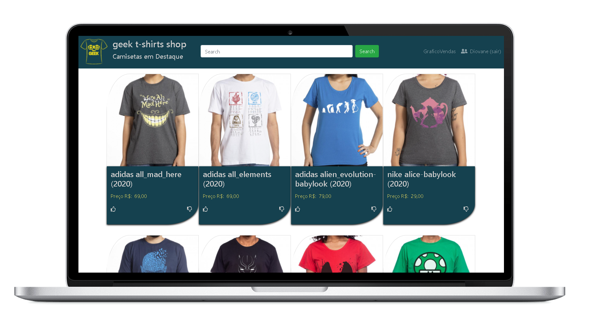

<h1 align="center"> Geek t-shirts shop Web</h1>

<p align="center">
    
    
    
</p>




## Tecnologias Utilizadas no projeto :construction:

- [Node.js](https://nodejs.org/en/) 
- [ReactJS](https://pt-br.reactjs.org/) 

- [Bootswatch](https://bootswatch.com/)


## Projeto :computer:

## Trabalho #3 – Integração de Apps React x Web Services
### Entrega / apresentação: 06/12/2021

> Web Services: Utilizar ou desenvolver/ajustar um Web Services que retorne uma lista de registros a serem
> exibidos na página para que o cliente possa interagir sobre eles. O Web Services deve conter também controle de

acesso do cliente/usuário.

Front-End: Desenvolver uma página utilizando os Hooks:
- useState
- useEffect
- useContext

Que apresente a listagem de itens obtida do Web Services e permita ao cliente avaliar/comentar/interagir  - sobre
- cada item.
- Conter rotina de login.
- Realizar filtro sobre os dados.
- Exibir dados estatísticos do cadastro.

[Repositorio de web service](https://github.com/DioenDJS/Projeto-Geek-t-shirts-shop) :package:

> - create-react-app
>
> ```npx create-react-app ```

## Como executar :gear:

- Clone o repositório `https://github.com/DioenDJS/Projeto-Geek-t-shirts-shop-Web.git`.
- Install as dependências com o comando `npm install`.
- Rode o `npm start` para iniciar a aplicação.<br />
Ao final a aplicação estará disponível em `http://localhost:3000`.

## Dependências do Projetos :card_index_dividers:

> - bootswatch
>
>``npm i bootswatch``

> - react-router-dom
>
>``npm i react-router-dom``
## utilizado no projeto :page_with_curl:

- [Bootstrap](https://maxcdn.bootstrapcdn.com/bootstrap/4.5.2/css/bootstrap.min.css)

inserir no head do index.html no diretório public
```
<link rel="stylesheet" href="maxcdn.bootstrapcdn.com/bootstrap/4.5.2/css/bootstrap.min.css">
```